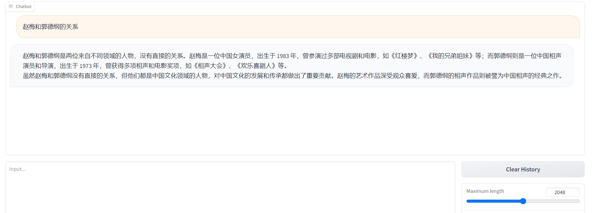
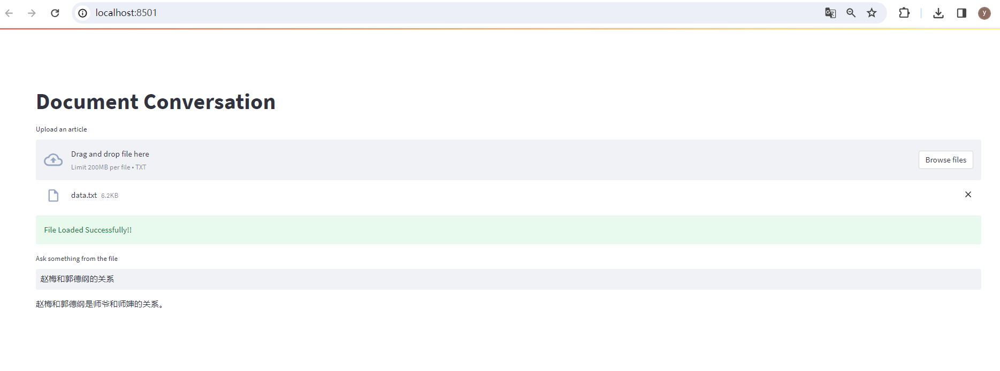

# DocQA 🤖


DocQA 🤖 is a web application built using Streamlit 🔥 and the LangChain 🦜🔗 framework, allowing users to leverage the power of LLMs for Generative Question Answering. 🌟 and use ChatGLM-6B

Read More Here 👉
https://ai.plainenglish.io/️-langchain-streamlit-llama-bringing-conversational-ai-to-your-local-machine-a1736252b172

## Installation
To run the LangChain web application locally, follow these steps:

step1: 启动chatglm-6b的api
```
cd chatGLM/ChatGLM-6B-main
python api.py
Loading checkpoint shards: 100%|████████████████████████████████████████████████████████████████████████████████████████████████████████████████████████████████████████████████████████████████████████| 8/8 [00:11<00:00,  1.38s/it]
INFO:     Started server process [1652]
INFO:     Waiting for application startup.
INFO:     Application startup complete.
INFO:     Uvicorn running on http://0.0.0.0:8000 (Press CTRL+C to quit)
```

step2: 启动本项目中的app.py
```
$ streamlit run app.py

  You can now view your Streamlit app in your browser.

  Local URL: http://localhost:8501
  Network URL: http://192.168.44.18:8501

```

## Usage
Once you have the Streamlit  web application up and running, you can perform the following steps:

1. Upload the Text File.(上传后，保存到本项目的temp中)
2. Once the Text File is loaded as the Vector Store Database it will show a success alert "Document is Loaded".
3. Insert the question in "Ask" textbox and submit your question for LLM to generate the answer.

## somecases
question: 赵梅和郭德纲的关系
### 原大模型的回答


### 外挂知识库后的回答


## 参考项目
[原DocQA](https://github.com/afaqueumer/DocQA.git)